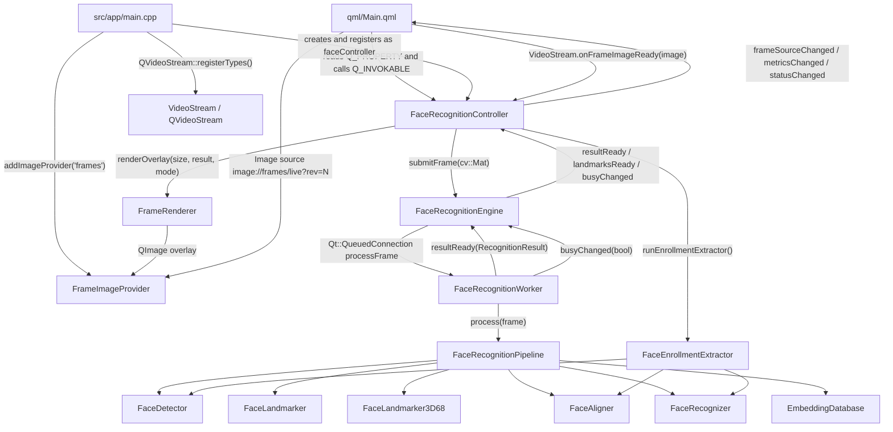

# Qt Face Recognition QML

## Before Running

The default configuration uses InsightFace `BUFFALO_S` family models:
`det_500m.onnx` for detection, `w600k_mbf.onnx` for embeddings, plus the
landmark models stored in `models/`. The pipeline can also use other compatible
ONNX models by updating the paths used by the GUI or by passing different paths
to `FaceRecognitionEngine::initialize(...)` when using the DLL.

Before launching the project, verify that the toolchain, native libraries,
models, and runtime folders are available:

```powershell
.\scripts\check_requirements.ps1
```

This repository can be used in two ways:

## 1. Use As A GUI

Short summary: the GUI application is a complete Qt/QML demo for real-time face
recognition. It lets you choose the video source, start the pipeline, display
overlays and landmarks, manage embeddings, and add new faces from a camera or a
folder.

## 2. Use As A Reusable DLL

Short summary: the same backend can be built as a headless DLL and integrated in
another Qt/C++ application. In this mode the host application provides frames,
receives results through Qt signals, and independently handles video, UI,
overlays, logs, and persistence.

Example repository for using the library when `FaceRecognition` is built as a
DLL: [FaceRecognitionLibUsage](../FaceRecognitionLibUsage).

## General Usage Demo Video

Demo video: TODO insert the general demo video link here.

## Main Features

- Face recognition from webcam, DirectShow source, file, or stream through
  QVideoStream/FFmpeg in the GUI.
- Face detection with the `det_500m.onnx` ONNX model.
- Face alignment and embedding generation with `w600k_mbf.onnx`.
- Matching against the `face_embeddings` database.
- CPU or CUDA support, with CPU fallback if the CUDA provider is not available.
- Graphic overlay with bounding box, recognized name, confidence, and landmarks.
- Runtime-selectable landmarks: off, 5 points, 106 points, all, or 68 3D points
  from `1k3d68.onnx`.
- Camera-guided enrollment with 15 photos and pose guidance.
- Enrollment from an existing image folder.
- Embedding list with refresh and deletion.
- Optional recognized-face saving in `faces/<name>`.
- Separate GUI build or backend DLL build without QML/QVideoStream.

## Project Structure

- `FaceRecognition.pro`: root qmake project. In the current file the initial
  mode is `dll`; use `CONFIG+=facerecognition_gui` to force the GUI or
  `CONFIG+=facerecognition_dll` to force the DLL.
- `FaceRecognitionApp.pro`: Qt Quick GUI target. It includes QML, the UI
  controller, image provider, overlay renderer, and QVideoStream.
- `FaceRecognitionLib.pro`: headless DLL target. It exports the backend through
  `FaceRecognitionEngine` and does not include the GUI.
- `FaceRecognitionBackend.pri`: backend sources shared by the GUI and DLL.
- `qml/Main.qml`: Qt Quick interface, tabs, controls, video panel, and bindings.
- `src/app`: GUI bootstrap (`main.cpp`), metatype registration, `VideoStream`,
  image provider, and `faceController`.
- `src/ui`: QML/backend bridge, overlay rendering, and `image://frames`
  provider.
- `src/api`: reusable `FaceRecognitionEngine` facade.
- `src/pipeline`: asynchronous worker, recognition pipeline, and C++ extractor
  for adding new faces.
- `src/vision`: detector, landmarker, aligner, recognizer, shared types, and
  embedding math.
- `src/storage`: face database loading and matching.
- `src/inference`: CPU/CUDA device selection.
- `src/utils`: runtime path resolution.
- `third_party/qvideostream`: FFmpeg video decoder/renderer used by the GUI.
- `models`: required ONNX models.
- `face_embeddings`: known-face database (`embeddings.json`, `metadata.json`,
  `.pkl` files).

## Additional Documentation

- [Architecture and class wiring](docs/ARCHITECTURE.md)
- [Runtime flow, DLL API, build, and dependencies](docs/USAGE_DETAILS.md)
- [ONNX model license report](docs/MODEL_LICENSES.md)
- [Native requirements and dependencies](requirements.md)

## GUI Application

The GUI is defined in `qml/Main.qml` and exposes the C++ controller as
`faceController`. Global controls are at the top; four tabs are shown below.

### Top Bar

- Video source field: updates `faceController.videoUrl`. The GUI supports
  sources such as:
  - `video=Full HD webcam`
  - `file:C:\Users\Edoardo\Videos\video.mp4`
  - `rtsp://192.168.2.100:554`
- Inference selector: `CPU` or `CUDA`. If the app is already running, the
  controller recreates the engine with the requested device.
- `Start`/`Stop` button: initializes models and database, then enables or stops
  frame analysis.
- Text status: shows `Ready`, `Loading models`, `Running`, load errors, or
  brightness-related warnings.

### Recognition Tab

Use this tab for live recognition.

- `Split overlay`: shows the video and overlay in separate views. When disabled,
  the transparent overlay is drawn over the video.
- `Save recognized faces`: enables automatic saving only for recognized faces
  whose confidence is above the threshold. Crops are saved in `faces/<name>`.
- Landmark selector: changes `landmarkMode` live and therefore which points are
  calculated and drawn.
- Video panel: `VideoStream` decodes frames and passes them to the controller
  with `submitVideoFrame(QImage)`.
- Bottom statistics: status, face count, pipeline FPS, and brightness.

In this tab the video is still handled by QVideoStream. The backend analyzes one
frame at a time: if the worker is busy, later frames can be skipped without
blocking the UI.

### Add Face Tab

Use this tab to add a person from the camera.

- `Person` field: name to use in `embeddings.json`, `metadata.json`, and `.pkl`
  files.
- `Capture`: starts a guided 15-photo session.
- `Cancel`: cancels the current session and removes temporary images.
- Progress bar: shows how many photos have been acquired or whether the
  extractor is running.
- Guide overlay: draws a circle and target point to guide the pose.

The controller temporarily saves images in `tmp/add_faces`. Each capture is
accepted only if a single face is visible and the current pose matches the
requested step: frontal, about 15 degrees right/left, about 30 degrees
right/left, slightly up/down, and up to about 60 degrees. When the 15 photos are
ready, `FaceEnrollmentExtractor` creates the average embedding, updates the
persistent files, and reloads the in-memory database.

### Load Face Tab

Use this tab to add a person from an existing image folder.

- `Person` field: name to associate with the embedding.
- `Folder path` field: folder containing `.jpg`, `.jpeg`, `.png`, or `.bmp`
  images.
- `Load`: starts the C++ extractor without using the camera.
- Center panel: shows the operation status.

The folder is normalized even if the path arrives quoted or as `file:///...`.
The extractor uses only valid images with exactly one face, aligns the face,
extracts the embedding, and saves the average in `face_embeddings`.

### Embeddings Tab

Use this tab to inspect and maintain the local database.

- Shows names from `face_embeddings/embeddings.json`.
- `Refresh`: rereads the database from disk and, if the engine is initialized,
  reloads embeddings in memory.
- `Delete`: removes the selected name from `embeddings.json` and
  `metadata.json`, deletes the related `.pkl` if present, and reloads the
  database.

If no faces are saved, the list shows `No embeddings saved`.

## Class Wiring And Signal/Slot

This diagram shows how the main classes are connected and where Qt
signals/slots flow.



Main signals/slots:

- `VideoStream.onFrameImageReady(QImage)` -> `FaceRecognitionController::submitVideoFrame`.
- `FaceRecognitionController` -> `FaceRecognitionEngine::submitFrame(cv::Mat)`.
- `FaceRecognitionEngine` -> `FaceRecognitionWorker::processFrame(cv::Mat)`
  with a queued connection on the worker thread.
- `FaceRecognitionWorker::resultReady(RecognitionResult)` ->
  `FaceRecognitionEngine::resultReady(RecognitionResult)`.
- `FaceRecognitionEngine::resultReady(RecognitionResult)` ->
  `FaceRecognitionController::handleResult`.
- `FaceRecognitionEngine::landmarksReady(RecognitionResult)` ->
  `FaceRecognitionController::landmarksReady`, also useful for external
  renderers.
- `FaceRecognitionWorker::busyChanged(bool)` ->
  `FaceRecognitionEngine::busyChanged(bool)` ->
  `FaceRecognitionController::handleBusyChanged`.
- `FaceRecognitionController::frameSourceChanged`, `metricsChanged`,
  `statusChanged`, `knownFacesChanged`, and `enrollmentChanged` update the GUI.
- `FaceRecognitionEngine::optionsChanged` updates the `landmarkMode` visible in
  QML.

For runtime flow, DLL API, host examples, build steps, and local dependencies,
see [Runtime flow, DLL API, build, and dependencies](docs/USAGE_DETAILS.md).
