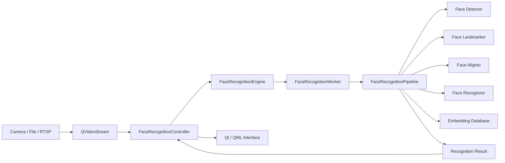

<div align="center">

# Qt Face Recognition

**Real-time face detection, recognition and enrollment built entirely with Qt, QML and C++.**

[](#requirements)
[](#requirements)
[](#)
[](#requirements)
[](#main-features)

</div>

<video src="https://raw.githubusercontent.com/DarkShrill/FaceRecognition/master/docs/test.mp4"
       controls
       width="800">
</video>
▶️ [Demo Here](https://github.com/DarkShrill/FaceRecognition/blob/master/docs/test.mp4)
---

## Overview

Qt Face Recognition is a native Windows face-recognition system developed entirely in **Qt, QML and C++**.

The project provides:

* a complete desktop GUI for real-time recognition;
* a reusable headless DLL for integration into other Qt/C++ applications;
* face detection, alignment and embedding extraction using ONNX models;
* CPU and CUDA inference through ONNX Runtime;
* live enrollment and local embedding management.

The application reuses and integrates components from my other repositories, including [QVideoStream](https://github.com/DarkShrill/QVideoStream).

<!-- Add a screenshot or animated GIF here when available.

<p align="center">
  
</p>

-->

## Main Features

* Real-time recognition from webcams, video files, DirectShow sources and RTSP streams.
* Face detection using `det_500m.onnx`.
* Face alignment and embedding extraction using `w600k_mbf.onnx`.
* Matching against a local face-embedding database.
* CPU and CUDA execution with automatic CPU fallback.
* Bounding boxes, recognized names, confidence values and facial landmarks.
* Runtime-selectable landmark modes:

  * disabled;
  * 5 points;
  * 106 points;
  * all available landmarks;
  * 68 three-dimensional points.
* Guided camera enrollment using 15 images and pose instructions.
* Enrollment from an existing image folder.
* Embedding inspection, refresh and deletion.
* Optional saving of recognized face crops.
* Standalone GUI and reusable DLL build modes.

## Build Modes

The project can be compiled in two different modes.

| Mode  | Output                   | Intended use                                |
| ----- | ------------------------ | ------------------------------------------- |
| `gui` | `FaceRecognition.exe`    | Complete Qt Quick desktop application       |
| `dll` | `FaceRecognition.dll` | Integration into another Qt/C++ application |

Select the desired mode in `FaceRecognition.pro`.

### GUI mode

```qmake
FACE_RECOGNITION_MODE = gui
```

This is the default configuration.

The recognition backend is compiled directly into the application, while the required `QVideoStream` dependency is built automatically before the GUI.

> Building `FaceRecognitionLib.dll` first is not required when using GUI mode.

### DLL mode

```qmake
FACE_RECOGNITION_MODE = dll
```

This mode builds the headless `FaceRecognitionLib` library without QML or video-management components.

The host application is responsible for:

* providing input frames;
* displaying video and overlays;
* receiving recognition results through Qt signals;
* managing logs, persistence and application-specific UI.

An integration example is available in:

[FaceRecognitionLibUsage](https://github.com/DarkShrill/FaceRecognitionLibUsage)

Build modes can also be overridden from qmake:

```powershell
qmake CONFIG+=facerecognition_gui
```

or:

```powershell
qmake CONFIG+=facerecognition_dll
```

## Requirements

The project currently targets **Windows x64** and the MSVC toolchain.

| Dependency       | Expected version                        |
| ---------------- | --------------------------------------- |
| Visual Studio    | Visual Studio 2022 / MSVC v143          |
| Qt               | Qt 6.9.0 MSVC 2022 64-bit               |
| ONNX Runtime GPU | 1.20.1                                  |
| CUDA             | 12.x                                    |
| cuDNN            | 9.x                                     |
| OpenCV           | 4.13.0                                  |
| FFmpeg           | Provided through the QVideoStream setup |

Use the Qt **MSVC kit**, not MinGW.

Complete installation paths and dependency instructions are available in [requirements.md](requirements.md).

## Quick Start

### 1. Clone the repository

Clone the project together with its submodules:

```powershell
git clone --recursive https://github.com/DarkShrill/FaceRecognition.git
cd FaceRecognition
```

For an existing clone, initialize or update the submodules with:

```powershell
git submodule update --init --recursive
```

### 2. Check the dependencies

Run the included PowerShell checker:

```powershell
powershell -ExecutionPolicy Bypass -File .\scripts\check_requirements.ps1
```

The script verifies the availability of:

* Qt;
* MSVC;
* ONNX Runtime;
* CUDA;
* cuDNN;
* OpenCV;
* FFmpeg;
* the required runtime folders.

### 3. Select the build mode

Open `FaceRecognition.pro` and choose:

```qmake
FACE_RECOGNITION_MODE = gui
```

or:

```qmake
FACE_RECOGNITION_MODE = dll
```

### 4. Build with Qt Creator

1. Open `FaceRecognition.pro`.
2. Select the **Qt 6.9 MSVC 2022 64-bit** kit.
3. Run qmake.
4. Build the project in Debug or Release mode.
5. Run the generated executable or use the generated DLL in the host application.

## Models

The default configuration uses models from the InsightFace `BUFFALO_S` family.

| Purpose               | Model            |
| --------------------- | ---------------- |
| Face detection        | `det_500m.onnx`  |
| Face embeddings       | `w600k_mbf.onnx` |
| 106-point landmarks   | `2d106det.onnx`  |
| 68-point 3D landmarks | `1k3d68.onnx`    |

Models are loaded from the `models/` directory.

Compatible ONNX models can be used by changing the configured paths or by passing alternative paths to:

```cpp
FaceRecognitionEngine::initialize(...)
```

See [MODEL_LICENSES.md](docs/MODEL_LICENSES.md) for model-specific licensing information.

## GUI Usage

The GUI provides four main sections.

### Recognition

Perform live recognition from a webcam, video file or network stream.

The interface displays:

* video frames;
* face bounding boxes;
* names and confidence values;
* landmarks;
* detected-face count;
* pipeline FPS;
* brightness information.

Example source values:

```text
video=Full HD webcam
```

```text
file:C:\Users\User\Videos\video.mp4
```

```text
rtsp://192.168.1.100:554
```

### Add Face

Create a new identity using the camera.

The application guides the user through a 15-image capture sequence with different head poses. Valid images are aligned and combined into an average face embedding.

### Load Face

Create an identity from an existing folder containing:

```text
.jpg
.jpeg
.png
.bmp
```

Only images containing exactly one valid face are used.

### Embeddings

Inspect and manage the local face database.

Available operations include:

* refreshing the embedding list;
* deleting an identity;
* reloading embeddings into the running recognition engine.

## Using the DLL

The reusable API is exposed through `FaceRecognitionEngine`.

A host application can:

1. initialize the engine;
2. select CPU or CUDA;
3. submit `cv::Mat` frames;
4. receive recognition results through Qt signals;
5. independently render overlays and manage the user interface.

Simplified example:

```cpp
FaceRecognitionEngine *engine = new FaceRecognitionEngine(this);

connect(
    engine,
    &FaceRecognitionEngine::resultReady,
    this,
    &MyApplication::handleRecognitionResult
);

engine->initialize(options);
engine->submitFrame(frame);
```

Detailed API and runtime-flow documentation is available in [USAGE_DETAILS.md](docs/USAGE_DETAILS.md).

## Architecture



The recognition worker runs asynchronously. When the worker is processing a frame, newer frames can be skipped to prevent the video interface from being blocked.

## Project Structure

```text
FaceRecognition/
├── FaceRecognition.pro
├── FaceRecognitionApp.pro
├── FaceRecognitionLib.pro
├── FaceRecognitionBackend.pri
├── qml/
│   └── Main.qml
├── src/
│   ├── api/
│   ├── app/
│   ├── inference/
│   ├── pipeline/
│   ├── storage/
│   ├── ui/
│   ├── utils/
│   └── vision/
├── models/
├── face_embeddings/
├── scripts/
├── docs/
└── third_party/
    └── qvideostream/
```

## Documentation

Additional technical documentation:

* [Architecture and class wiring](docs/ARCHITECTURE.md)
* [Runtime flow, DLL API and build details](docs/USAGE_DETAILS.md)
* [ONNX model licenses](docs/MODEL_LICENSES.md)
* [Native dependencies and requirements](requirements.md)

## Related Projects

* [QVideoStream](https://github.com/DarkShrill/QVideoStream)
* [FaceRecognitionLibUsage](https://github.com/DarkShrill/FaceRecognitionLibUsage)

## Status

The project is under active development.

A complete demonstration video and additional deployment instructions will be added in future updates.
