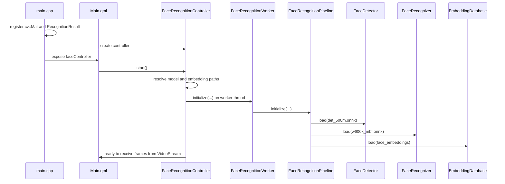
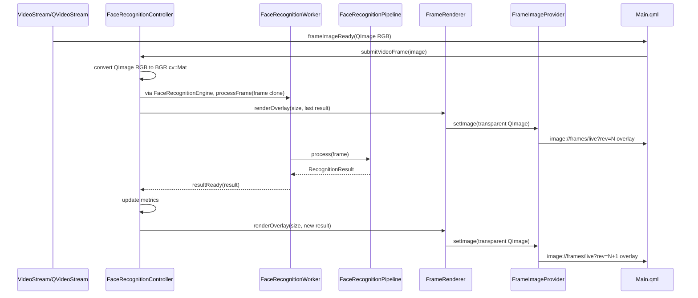
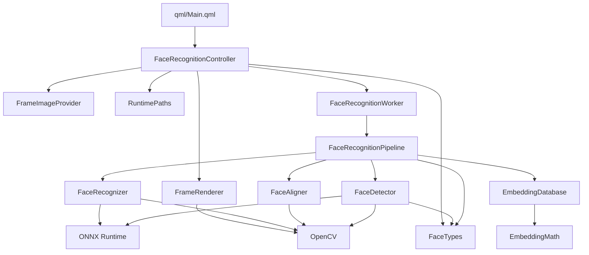

# FaceRecognition - Architecture Documentation

This document describes how the project is organized, the responsibilities of
the main classes, and how data flows from the QML UI to the ONNX/OpenCV models.

The refactor splits the code into modules with clear responsibilities:

- the UI exposes state and commands to QML;
- QVideoStream/FFmpeg handles video acquisition and rendering;
- the controller receives frames already decoded by QML and forwards them to the
  engine;
- the worker isolates asynchronous work on a dedicated thread;
- the pipeline contains the face-recognition logic;
- detector, aligner, and recognizer are independent vision components;
- the embedding database handles loading and matching known faces;
- utilities handle cross-cutting concerns such as runtime paths and embedding
  math.

## Folder Structure

```text
FaceRecognition/
|-- FaceRecognition.pro
|-- qml/
|   `-- Main.qml
|-- src/
|   |-- api/
|   |   `-- FaceRecognitionEngine.*
|   |-- app/
|   |   `-- main.cpp
|   |-- ui/
|   |   |-- FaceRecognitionController.*
|   |   |-- FrameImageProvider.*
|   |   `-- FrameRenderer.*
|   |-- pipeline/
|   |   |-- FaceRecognitionWorker.*
|   |   `-- FaceRecognitionPipeline.*
|   |-- vision/
|   |   |-- FaceTypes.h
|   |   |-- FaceDetector.*
|   |   |-- FaceAligner.*
|   |   |-- FaceRecognizer.*
|   |   `-- EmbeddingMath.*
|   |-- storage/
|   |   `-- EmbeddingDatabase.*
|   |-- inference/
|   |   `-- InferenceDevice.h
|   `-- utils/
|       `-- RuntimePaths.*
|-- third_party/
|   `-- qvideostream/
|       |-- videodecoder.*
|       `-- videorendereritem.*
|-- models/
`-- face_embeddings/
```

### `src/app`

Contains the Qt application bootstrap.

`main.cpp`:

- creates `QGuiApplication`;
- registers the `cv::Mat` and `RecognitionResult` metatypes;
- creates the `QQmlApplicationEngine`;
- registers `FrameImageProvider` as the `image://frames` provider;
- registers `VideoRendererItem` as the QML type `VideoStream 1.0`;
- creates `FaceRecognitionController`;
- exposes the controller to QML as `faceController`;
- loads `qrc:/qml/Main.qml`.

### `src/api`

Contains the reusable library facade.

`FaceRecognitionEngine`:

- does not open webcams;
- does not know QML;
- does not draw overlays;
- receives BGR OpenCV frames through `submitFrame(cv::Mat)` /
  `processFrame(cv::Mat)`;
- publishes results through Qt signals;
- owns the internal worker thread;
- allows `landmarkMode` to be changed live.

This is the export point when the project is separated as a real library. The
demo app can keep using `FaceRecognitionController`, while a host app can link
directly to the engine and decide independently where frames come from and how
results are rendered.

The DLL build is available through `FaceRecognitionLib.pro` or from the root
project with `CONFIG+=facerecognition_dll`. It uses the same backend sources as
the GUI through `FaceRecognitionBackend.pri`, but it does not include `qml/`,
`src/app`, `src/ui`, or `third_party/qvideostream`.

### `src/ui`

Contains code that touches Qt Quick/QML.

This module should not contain ONNX logic or embedding matching. It is
responsible for:

- properties exposed to the UI;
- visual state;
- image updates;
- overlay rendering;
- the connection between QML, QVideoStream, and the asynchronous pipeline.

### `third_party/qvideostream`

Contains an adapted version of `DarkShrill/QVideoStream`.

Responsibilities:

- use FFmpeg to open `video=...`, `rtsp://...`, or file sources;
- render video in QML through `VideoStream`;
- emit every RGB frame as `QImage` with `frameImageReady(QImage)`;
- leave only the `QImage -> cv::Mat` conversion for inference to the
  controller.

License note: the upstream README says MIT, but as of 2026-06-22 the GitHub
repository did not expose a downloadable `LICENSE` file. Before distributing a
commercial library, clarify or add an explicit license.

### `src/pipeline`

Contains the recognition orchestration.

`FaceRecognitionWorker` is an asynchronous Qt adapter.

`FaceRecognitionPipeline` is the real application pipeline:

1. checks frame brightness;
2. resizes the frame for detection;
3. runs face detection;
4. maps bounding boxes and landmarks back to the original scale;
5. aligns the face;
6. extracts the embedding;
7. compares the embedding with the database;
8. produces a `RecognitionResult`.

### `src/vision`

Contains reusable OpenCV/ONNX components.

- `FaceDetector`: loads and runs the SCRFD model to find faces.
- `FaceAligner`: normalizes/crops the face using the 5 landmarks.
- `FaceRecognizer`: loads and runs the ArcFace/recognizer model to extract
  embeddings.
- `FaceTypes`: defines `DetectedFace` and `RecognitionResult`.
- `EmbeddingMath`: contains mathematical helpers for embeddings, such as cosine
  similarity.

### `src/storage`

Contains persistent data loading and lookup.

`EmbeddingDatabase`:

- loads `face_embeddings/embeddings.json` as the primary format;
- supports fallback to individual `.json` files;
- keeps a list of `KnownFace`;
- compares an input embedding with known embeddings;
- returns name and confidence percentage.

### `src/inference`

Contains common types for inference backend selection.

`InferenceDevice` currently supports:

- `CPU`;
- `CUDA`.

The real provider selection is then handled by `FaceDetector` and
`FaceRecognizer`.

### `src/utils`

Contains cross-cutting utilities that do not belong to UI, pipeline, or vision.

`RuntimePaths` resolves runtime paths in this order:

1. executable folder;
2. current working directory;
3. source folder defined by `APP_SOURCE_DIR`.

This makes `models/` and `face_embeddings/` discoverable both from the build
output and during development.

## Class Wiring Diagram

```mermaid
classDiagram
    direction LR

    class MainQml {
        +start()
        +stop()
        +frameSource
        +status
        +faceCount
        +fps
        +brightness
        +lowLight
    }

    class main_cpp {
        +register metatypes
        +create QML engine
        +install image provider
        +expose controller
    }

    class FaceRecognitionController {
        +start()
        +stop()
        +landmarkMode
        +videoUrl
        +submitVideoFrame(image)
        +frameSource()
        -updateDisplay()
    }

    class VideoStream {
        +url
        +play()
        +start(url)
        +stop()
        +frameImageReady(image)
    }

    class FaceRecognitionEngine {
        +initialize()
        +submitFrame(frame)
        +processFrame(frame)
        +landmarkMode
        +resultReady(result)
        +landmarksReady(result)
        +frameSubmitted(frame)
    }

    class FrameImageProvider {
        +requestImage()
        +setImage()
        -QImage image
        -QMutex mutex
    }

    class FrameRenderer {
        +render(frame, result) QImage
        -matToQImage()
        -drawCornerBox()
    }

    class RuntimePaths {
        +resolve(relativePath) QString
    }

    class FaceRecognitionWorker {
        +initialize()
        +processFrame()
        +resultReady(result)
        +busyChanged(busy)
        -atomic_bool busy
    }

    class FaceRecognitionPipeline {
        +initialize()
        +process(frame) RecognitionResult
        -isLowLight()
    }

    class FaceDetector {
        +load()
        +detect()
        -forward()
        -nms()
    }

    class FaceAligner {
        +normCrop()
        -targetPoints()
    }

    class FaceRecognizer {
        +load()
        +extract()
    }

    class EmbeddingDatabase {
        +load()
        +match()
        -parseEmbedding()
    }

    class EmbeddingMath {
        +cosineSimilarity()
    }

    class FaceTypes {
        DetectedFace
        RecognitionResult
    }

    main_cpp --> FaceRecognitionController : creates
    main_cpp --> FrameImageProvider : creates/registers
    MainQml --> FaceRecognitionController : calls and reads properties
    MainQml --> VideoStream : renders/decodes video
    MainQml --> FrameImageProvider : image://frames overlay

    FaceRecognitionController --> RuntimePaths : resolves models/data
    FaceRecognitionController --> VideoStream : receives QImage through QML signal
    FaceRecognitionController --> FaceRecognitionEngine : submits camera frames
    FaceRecognitionController --> FrameRenderer : renders overlay
    FaceRecognitionController --> FrameImageProvider : publishes transparent overlay
    FaceRecognitionController --> FaceTypes : reads RecognitionResult

    FaceRecognitionEngine --> FaceRecognitionWorker : queued calls
    FaceRecognitionWorker --> FaceRecognitionPipeline : delegates processing
    FaceRecognitionPipeline --> FaceDetector : detects faces
    FaceRecognitionPipeline --> FaceAligner : aligns faces
    FaceRecognitionPipeline --> FaceRecognizer : extracts embeddings
    FaceRecognitionPipeline --> EmbeddingDatabase : matches embeddings
    FaceRecognitionPipeline --> FaceTypes : produces result

    EmbeddingDatabase --> EmbeddingMath : cosine similarity
    FaceDetector --> FaceTypes : returns DetectedFace
```

## Startup Flow



## Frame-By-Frame Flow



## Library Usage

To integrate recognition in another application, the clean entry point is
`FaceRecognitionEngine`.

C++ example:

```cpp
FaceRecognitionEngine engine(InferenceDevice::CPU);
engine.setLandmarkMode(static_cast<int>(LandmarkMode::FivePoints));

engine.initialize(detectorPath, landmarkPath, landmark3dPath, recognizerPath, embeddingsDir);

connect(videoSource, &VideoSource::frameReady,
        &engine, &FaceRecognitionEngine::submitFrame);

connect(&engine, &FaceRecognitionEngine::resultReady,
        renderer, &CustomRenderer::drawRecognitionResult);

connect(&engine, &FaceRecognitionEngine::landmarksReady,
        renderer, &CustomRenderer::drawLandmarks);
```

Frame contract:

- input: BGR `cv::Mat`;
- ownership: the frame is cloned inside `submitFrame()` before crossing threads;
- concurrency: if the engine is busy, the frame is ignored;
- main output: `RecognitionResult`;
- landmark output: `landmarksReady(RecognitionResult)`, emitted only when
  `landmarkMode != None`;
- 106 model: required only if `landmarkMode` is `Points106` or `All`; with
  `None`, `FivePoints`, and `Points3D68`, the pipeline can initialize without
  the 106 landmarker;
- 3D 68 model: required only if `landmarkMode` is `Points3D68` or `All`; with
  the other modes, the pipeline can initialize without `1k3d68.onnx`.

Landmark modes:

```text
0 = None       no landmarks drawn/exposed, skips full landmark models
1 = FivePoints exposes/draws only the detector's 5 keypoints
2 = Points106  computes and exposes/draws only the 106 landmarks
3 = All        exposes/draws 5 keypoints + 106 landmarks + 68 3D landmarks
4 = Points3D68 computes and exposes/draws only the 68 3D landmarks
```

Note: the detector's 5 keypoints remain available internally for face alignment
even when `landmarkMode` is `None`, because the recognizer needs them.

## Main Class Responsibilities

### `FaceRecognitionController`

Files:

- `src/ui/FaceRecognitionController.h`
- `src/ui/FaceRecognitionController.cpp`

This is the bridge between the QML UI and the backend.

Responsibilities:

- expose QML properties: `frameSource`, `status`, `running`, `faceCount`, `fps`,
  `brightness`, `lowLight`;
- expose `landmarkMode` to change which landmarks are shown/calculated live;
- expose `videoUrl` for the demo's QVideoStream source;
- expose QML commands: `start()` and `stop()`;
- receive frames from `VideoStream` with `submitVideoFrame(QImage)`;
- convert RGB `QImage` to BGR `cv::Mat` for the engine;
- send frames to `FaceRecognitionEngine` only if the worker is not busy;
- keep the last frame and last `RecognitionResult`;
- update `FrameImageProvider` with a transparent overlay.

It should not:

- load ONNX models directly;
- perform embedding matching;
- contain recognition math functions;
- know SCRFD/ArcFace internals.

### `FrameImageProvider`

Files:

- `src/ui/FrameImageProvider.h`
- `src/ui/FrameImageProvider.cpp`

Exposes the current overlay to the QML UI through `image://frames`.

The class is protected by `QMutex` because the image can be updated by the
controller while QML requests it.

If no overlay is available yet, it returns a transparent image.

### `FrameRenderer`

Files:

- `src/ui/FrameRenderer.h`
- `src/ui/FrameRenderer.cpp`

Transforms a `cv::Mat` into a `QImage` and draws visual overlays. With
QVideoStream, the demo uses `renderOverlay(...)`, which produces a transparent
image to place over the video:

- low-light warning;
- corner-style bounding box;
- recognized name;
- confidence;
- landmarks;
- inference FPS.

This separation keeps `FaceRecognitionController` from also becoming
responsible for OpenCV graphics.

### `FaceRecognitionWorker`

Files:

- `src/pipeline/FaceRecognitionWorker.h`
- `src/pipeline/FaceRecognitionWorker.cpp`

This is a `QObject` moved to a `QThread`.

Responsibilities:

- receive queued calls from `FaceRecognitionController`;
- prevent concurrent processing with `std::atomic_bool m_busy`;
- emit `busyChanged`;
- emit `resultReady`;
- receive `FaceRecognitionOptions` from the facade;
- delegate all logic to `FaceRecognitionPipeline`.

It no longer directly contains detector, aligner, recognizer, or database logic.

### `FaceRecognitionPipeline`

Files:

- `src/pipeline/FaceRecognitionPipeline.h`
- `src/pipeline/FaceRecognitionPipeline.cpp`

This is the central application class for recognition.

Responsibilities:

- initialize models and database;
- calculate average brightness;
- run detection on a resized frame;
- map bounding boxes and landmarks back to the original scale;
- align each face;
- extract embeddings;
- find the match in the database;
- calculate inference FPS;
- build `RecognitionResult`;
- respect `FaceRecognitionOptions::landmarkMode` to avoid full landmark models
  when they are not needed.

This is the right place to change the recognition strategy.

### `FaceDetector`

Files:

- `src/vision/FaceDetector.h`
- `src/vision/FaceDetector.cpp`

Handles the face detection model.

Responsibilities:

- configure ONNX Runtime;
- choose CPU/CUDA where available;
- load the model;
- preprocess the frame;
- run the ONNX session;
- interpret SCRFD outputs;
- apply NMS;
- return a list of `DetectedFace`.

### `FaceAligner`

Files:

- `src/vision/FaceAligner.h`
- `src/vision/FaceAligner.cpp`

Aligns a face using 5 landmarks.

It uses an affine transform estimated by OpenCV and produces a normalized crop,
currently typically `112x112`, ready for the recognizer.

### `FaceRecognizer`

Files:

- `src/vision/FaceRecognizer.h`
- `src/vision/FaceRecognizer.cpp`

Handles the ONNX model that produces face embeddings.

Responsibilities:

- configure ONNX Runtime;
- load the recognizer model;
- adapt input size from the model;
- preprocess the aligned face;
- run inference;
- return the embedding vector.

### `EmbeddingDatabase`

Files:

- `src/storage/EmbeddingDatabase.h`
- `src/storage/EmbeddingDatabase.cpp`

Loads known-face embeddings and finds the best match.

Primary format:

- `face_embeddings/embeddings.json`

Fallback:

- separate `.json` files inside `face_embeddings/`.

The class returns:

- `"Unknown"` if no match is above threshold;
- the face name if the match exceeds the threshold;
- confidence percentage derived from similarity.

### `EmbeddingMath`

Files:

- `src/vision/EmbeddingMath.h`
- `src/vision/EmbeddingMath.cpp`

Contains cosine similarity between embedding vectors.

It is separated from `FaceRecognizer` because the database must compare
embeddings, but it should not depend on the component that runs the ONNX model.

### `RuntimePaths`

Files:

- `src/utils/RuntimePaths.h`
- `src/utils/RuntimePaths.cpp`

Centralizes runtime file resolution.

The controller uses it to find:

- `models/det_500m.onnx`;
- `models/w600k_mbf.onnx`;
- `face_embeddings`.

## Threading And Concurrency

The main Qt thread handles:

- QML;
- `FaceRecognitionController`;
- `VideoStream` rendering;
- `FrameImageProvider` overlay updates.

The worker thread handles:

- pipeline initialization;
- inference;
- matching;
- `RecognitionResult` production.

The controller sends frames to the worker with `Qt::QueuedConnection`.

Initialization uses `Qt::BlockingQueuedConnection`, so the model is loaded in
the correct thread and `start()` can immediately know whether the operation
succeeded.

`FaceRecognitionWorker` uses `std::atomic_bool m_busy` to prevent multiple
frames from being processed concurrently. If the worker is still processing,
QVideoStream keeps showing video and the controller keeps the last available
overlay.

## State Exposed To QML

`Main.qml` directly reads the singleton exposed as `faceController`.

Main properties:

- `frameSource`: `image://frames/live?rev=N` URL, updated after every newly
  rendered frame;
- `status`: text status, for example `Ready`, `Loading models`, `Running`,
  `Stopped`;
- `running`: indicates whether the engine is ready to receive frames from
  QVideoStream;
- `faceCount`: number of faces in the latest result;
- `fps`: inference FPS calculated by the pipeline;
- `brightness`: average frame brightness;
- `lowLight`: indicates whether brightness is below threshold;
- `landmarkMode`: controls live overlay and 106/3D 68 landmark calculation;
- `videoUrl`: source used by the QML demo with `VideoStream`.

Commands:

- `start()`;
- `stop()`.

## Runtime Models And Data

The `.pro` copies these to the output:

- `models/*.onnx`;
- `face_embeddings/*`;
- ONNX Runtime DLLs;
- required OpenCV DLLs;
- FFmpeg DLLs required by QVideoStream.

Main paths are configured in the `.pro`:

```qmake
ONNXRUNTIME_ROOT = C:/onnxruntime
OPENCV_ROOT = C:/opencv-4.13.0/build/install
FFMPEG_ROOT = C:/QT_WORKSPACE/QVideoStream/ffmpeg
```

Important note: the project links OpenCV from `x64/vc17/lib`, so it is aligned
with an MSVC build. If you try to compile with MinGW, ONNX/OpenCV headers and
libraries may be incompatible.

## Where To Change What

To change UI, text, layout, or buttons:

- `qml/Main.qml`

To add a new property visible to QML:

- `src/ui/FaceRecognitionController.h`
- `src/ui/FaceRecognitionController.cpp`

To integrate an external video source or turn the project into a library:

- `src/api/FaceRecognitionEngine.h`
- `src/api/FaceRecognitionEngine.cpp`

To change the demo video source:

- `qml/Main.qml`
- `src/ui/FaceRecognitionController.h`
- `videoUrl` property

To change overlay, colors, face labels, or boxes:

- `src/ui/FrameRenderer.cpp`

To change analysis frequency or frame skipping:

- `src/ui/FaceRecognitionController.cpp`

To change the detector or recognizer model used at startup:

- `src/ui/FaceRecognitionController.cpp`

To change the recognition pipeline:

- `src/pipeline/FaceRecognitionPipeline.cpp`

To change the matching threshold:

- `src/pipeline/FaceRecognitionPipeline.cpp`
- call to `m_database.match(face.embedding, 0.35f)`

To change the embedding loading format:

- `src/storage/EmbeddingDatabase.cpp`

To change CPU/CUDA device behavior:

- `src/ui/FaceRecognitionController.cpp`
- construction of `FaceRecognitionWorker(InferenceDevice::CPU)`

To change detector preprocess or output interpretation:

- `src/vision/FaceDetector.cpp`

To change recognizer preprocess:

- `src/vision/FaceRecognizer.cpp`

## Recommended Architecture Rules

To keep the project modular:

- QML must not know OpenCV or ONNX.
- `FaceRecognitionController` must remain a Qt coordinator, not a pipeline.
- `FaceRecognitionWorker` must remain a thread-safe adapter, not contain
  business logic.
- `FaceRecognitionPipeline` is the right place for the recognition flow.
- `storage` must not include `FaceRecognizer`.
- `vision` must not depend on the UI.
- `utils` must contain only genuinely cross-cutting utilities.
- New classes should be added to the folder that represents their
  responsibility, then registered in `FaceRecognition.pro`.

## Main Dependencies



## Checklist For New Features

When adding a feature:

1. Understand whether it belongs to UI, pipeline, vision, storage, or utilities.
2. Put the code in the correct folder.
3. Avoid unnecessary cross-includes.
4. Update `FaceRecognition.pro`.
5. If the feature exposes data to QML, add a dedicated `Q_PROPERTY` and signal.
6. If it changes the recognition flow, start from `FaceRecognitionPipeline`.
7. If it only changes drawing on the frame, start from `FrameRenderer`.
8. If it adds runtime files, verify copy and path resolution in the `.pro` and
   in `RuntimePaths`.
