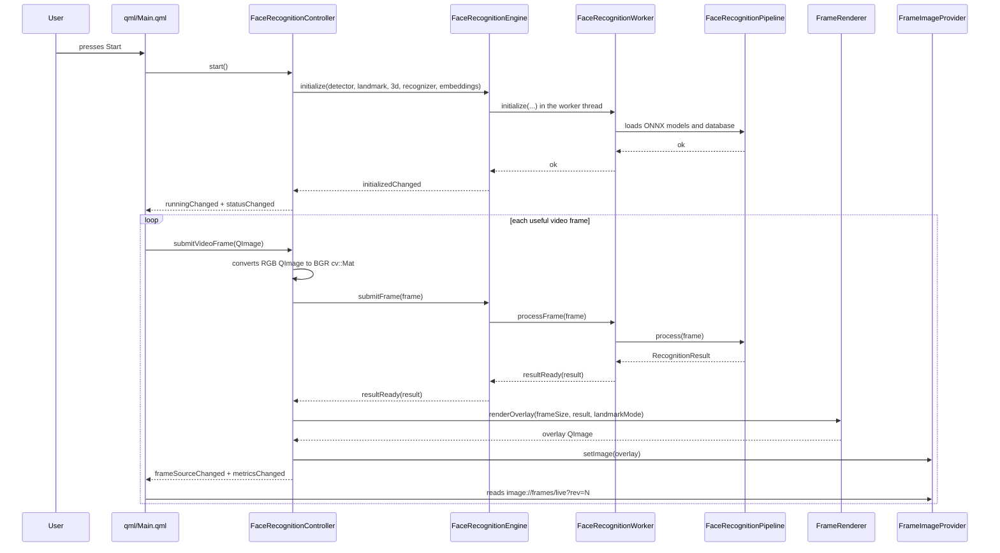
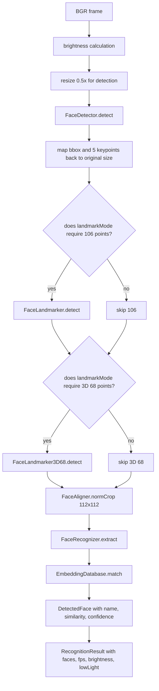
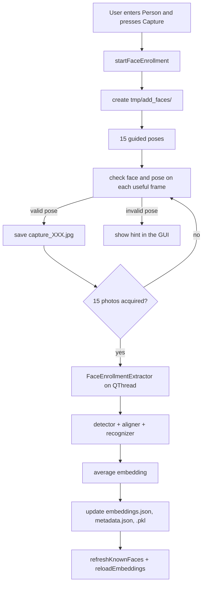

# FaceRecognition - Runtime Flow, DLL API, Build, And Dependencies

This page contains the extended documentation that follows the class wiring and
signal/slot section in the main README.

## Runtime Flow

### GUI Startup And Live Analysis



### Single-Frame Pipeline



### Add Face Enrollment



## Reusable API And DLL

The library entry point is `FaceRecognitionEngine`.

The DLL is identical to the GUI in the backend part: it uses the same sources
from `FaceRecognitionBackend.pri`, the same models, the same pipeline, the same
types (`RecognitionResult`, `DetectedFace`, `FaceRecognitionOptions`), and the
same main signals. The difference is that the DLL has no graphics, QML,
`FaceRecognitionController`, `FrameRenderer`, `FrameImageProvider`, or
QVideoStream. A DLL user must therefore:

1. create a Qt app with `QCoreApplication` or `QApplication`;
2. create `FaceRecognitionEngine`;
3. call `initialize(...)` with model paths and the embedding folder;
4. send BGR OpenCV frames with `submitFrame(cv::Mat)`;
5. listen to `resultReady(RecognitionResult)` and, if separate landmarks are
   needed, `landmarksReady(RecognitionResult)`;
6. decide outside the DLL how to capture video, draw overlays, save logs, or
   update a GUI.

`landmarkMode` can also be changed at runtime:

- `0`: no full landmarks exposed;
- `1`: only the detector's 5 keypoints;
- `2`: only 106 landmarks;
- `3`: all available landmarks;
- `4`: only 68 3D landmarks from `1k3d68.onnx`.

### DLL Usage Example

Minimal Qt console application using the DLL without graphics. OpenCV opens the
camera only as an example: in a real app, frames can come from any source as
long as they are BGR `cv::Mat` images.

```cpp
#include "FaceRecognitionEngine.h"
#include "FaceTypes.h"
#include "InferenceDevice.h"

#include <QCoreApplication>
#include <QDebug>
#include <QTimer>
#include <opencv2/opencv.hpp>

int main(int argc, char* argv[]) {
    QCoreApplication app(argc, argv);

    FaceRecognitionEngine engine(InferenceDevice::CPU);
    engine.setLandmarkMode(static_cast<int>(LandmarkMode::All));

    QObject::connect(&engine,
                     &FaceRecognitionEngine::resultReady,
                     [](const RecognitionResult& result) {
                         qInfo() << "faces:" << result.faces.size()
                                 << "fps:" << result.fps
                                 << "brightness:" << result.brightness;

                         for (const DetectedFace& face : result.faces) {
                             qInfo() << "name:" << face.name
                                     << "confidence:" << face.confidencePercent;
                         }
                     });

    QObject::connect(&engine,
                     &FaceRecognitionEngine::landmarksReady,
                     [](const RecognitionResult& result) {
                         qInfo() << "landmark result for" << result.faces.size() << "faces";
                     });

    const bool ok = engine.initialize(
        "models/det_500m.onnx",
        "models/face_landmark_2d_106.onnx",
        "models/1k3d68.onnx",
        "models/w600k_mbf.onnx",
        "face_embeddings");

    if (!ok) {
        qWarning() << "Cannot initialize FaceRecognitionEngine";
        return 1;
    }

    cv::VideoCapture camera(0);
    if (!camera.isOpened()) {
        qWarning() << "Cannot open camera";
        return 2;
    }

    QTimer timer;
    QObject::connect(&timer, &QTimer::timeout, [&]() {
        if (engine.isBusy()) {
            return;
        }

        cv::Mat frame;
        camera >> frame; // OpenCV returns BGR frames.
        if (!frame.empty()) {
            engine.submitFrame(frame);
        }
    });

    timer.start(30);
    return app.exec();
}
```

Example `.pro` for a host program importing the DLL:

```qmake
QT += core
CONFIG += c++17 console
TEMPLATE = app
TARGET = FaceRecognitionHost

INCLUDEPATH += \
    C:/QT_WORKSPACE/FaceRecognition/src/api \
    C:/QT_WORKSPACE/FaceRecognition/src/inference \
    C:/QT_WORKSPACE/FaceRecognition/src/vision \
    C:/opencv-4.13.0/build/install/include

LIBS += \
    -LC:/path/to/FaceRecognition/build/release -lFaceRecognition \
    -LC:/opencv-4.13.0/build/install/x64/vc17/lib -lopencv_world4130

SOURCES += main.cpp
```

The following must be available next to the host executable:

- `FaceRecognition.dll`;
- `onnxruntime.dll` and, if CUDA is used, the ONNX Runtime providers;
- `opencv_world4130.dll`;
- `models` folder;
- `face_embeddings` folder.

## Build Modes

Run these commands from a Developer Prompt for MSVC x64, or after `vcvars64.bat`.

GUI:

```powershell
qmake FaceRecognition.pro CONFIG+=release CONFIG+=facerecognition_gui
nmake
```

Backend DLL without QML, without `src/ui`, and without QVideoStream:

```powershell
qmake FaceRecognition.pro CONFIG+=release CONFIG+=facerecognition_dll
nmake
```

Alternatively, generate the DLL target directly:

```powershell
qmake FaceRecognitionLib.pro CONFIG+=release
nmake
```

The GUI target produces `FaceRecognition.exe`. The DLL target produces
`FaceRecognition.dll` plus the compiler import library.

## Configured Local Dependencies

- ONNX Runtime: `C:/onnxruntime`
- OpenCV: `C:/opencv-4.13.0/build/install`
- FFmpeg/QVideoStream: `third_party/qvideostream/ffmpeg`

OpenCV is not used by the GUI for video acquisition: in the QML demo, video
capture and rendering come from `VideoStream`/QVideoStream. OpenCV remains in
the pipeline for conversion, preprocessing, detection, alignment, landmarks,
embeddings, and recognition.

`RuntimePaths::resolve(...)` looks for models and data first next to the
executable, then in the working directory, and finally in the source folder when
`APP_SOURCE_DIR` is defined.
